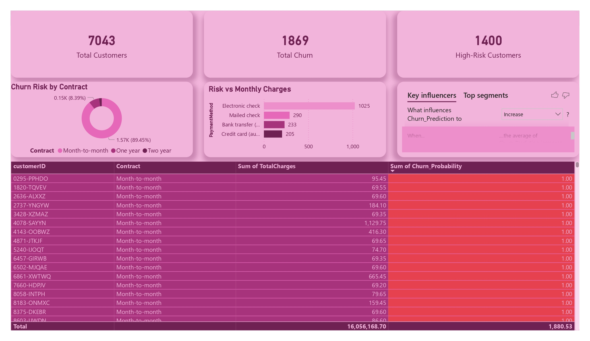

# 📱 Customer Churn Prediction & Retention Analytics

## 🔍 Project Overview
This project focuses on building a predictive analytics solution to identify customers at high risk of churn and support proactive retention strategies.
- Developed a machine learning model (Random Forest) to predict churn probability (~78% accuracy)  
- Performed data cleaning, preprocessing, and feature engineering on customer data  
- Built an automated data pipeline from Python to PostgreSQL  
- Developed an interactive Power BI dashboard to monitor churn risk and customer segments  
---
## 🛠️ Tech Stack
- **Language:** Python (Pandas, Scikit-learn, SQLAlchemy, Joblib)  
- **Database:** PostgreSQL (pg8000)  
- **Visualization:** Power BI  
---
## 📊 Key Insights
- Identified **1,400 high-risk customers** requiring immediate retention strategies  
- Customers with **month-to-month contracts contribute ~89% of total churn**  
- **Electronic check payment method** shows the highest churn risk  
- Churn probability scoring (0–1 scale) enables prioritized intervention  
---
## 💡 Business Impact
- Enables targeted retention campaigns by focusing on high-risk customers  
- Reduces marketing cost by avoiding unnecessary promotions  
- Supports data-driven decision making for customer retention strategies  
---
## 🔄 Data Pipeline & Modeling
This project implements an end-to-end predictive analytics workflow:
1. Data extracted from Kaggle dataset  
2. Data cleaned and preprocessed (handling missing values, type conversion)  
3. Feature engineering using One-Hot Encoding  
4. Model training using Random Forest Classifier  
5. Prediction results stored in PostgreSQL as a centralized data source  
6. Data visualized through Power BI dashboard  
---
## 📊 Dashboard Preview

The dashboard provides an action-oriented view of customer churn risk, including:
- High-risk customer identification  
- Churn probability scoring  
- Key influencing factors affecting churn  
- Customer segmentation for retention strategy  
---
## 📂 Dataset
The dataset used in this project is publicly available and sourced from Kaggle.
- **Dataset Name:** Telco Customer Churn Dataset  
- **Source:** Kaggle  
- **Link:** [Telco Customer Churn Dataset](https://www.kaggle.com/datasets/blastchar/telco-customer-churn)  
- **Note:** Only sample or processed data may be included in this repository.
---
## 📬 Contact
- **LinkedIn:** https://www.linkedin.com/in/alfin-syahrina  
- **Email:** alfinsyahrinafina@gmail.com
